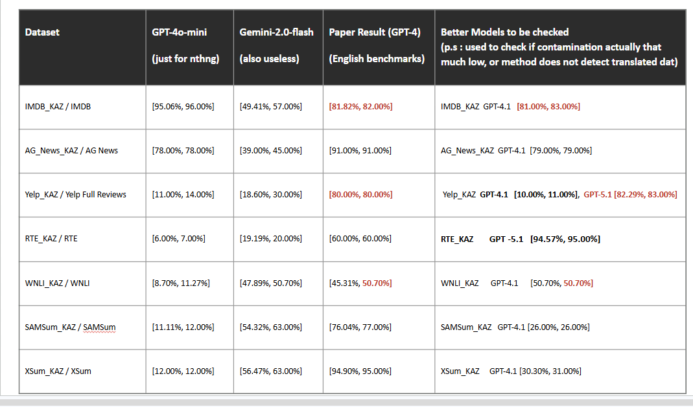

We are gonna test the same 7 models they have tested, but their translation in kazakh and japaneese (originally they have tested 10 models, but 3 models has been tested using fine tuning the models, sowe are gonna skip those 3 models).

So this repo is designed to check whether this method under the same condition ccan detect the contamination of the same benchmarks, but theur translation in kazakh and japaneese(gpt4 to make purtarbations, and gpt4 and gpt3.5 to be checked, we will skip llama open source models for now).

here is result for 7 datasets they detected contamination for, I am going to use the same set up, and those 7 datasets and their translation in kazakh. Later will be upadated with the results in kaz translations

UPDATE:

# how to run? 
1. First put the xlsx file into the excel translations folder, then run the xlsxl_to_csv.py to convert excel dataset to csv then run the following code with just one command. In the result u will get contamination percent

"""
chcp 65001 > $null
$ErrorActionPreference = "Stop"

Set-Location "C:\Users\Дамош\DCQ"

Write-Host "Step 1: Creating random 100 samples from SAMSum..." -ForegroundColor Cyan
$rows = Import-Csv ".\data\csv_translations\SAMSum_KAZ_Translation.csv" | Get-Random -Count 100
$rows | ConvertTo-Csv -NoTypeInformation | Set-Content ".\data\csv_translations\SAMSum_KAZ_Translation_100.csv" -Encoding utf8
Write-Host "✓ Saved 100 samples to SAMSum_KAZ_Translation_100.csv" -ForegroundColor Green

Write-Host "`nStep 2: Generating quiz options..." -ForegroundColor Cyan
python .\src\generating_quiz_options.py `
  --filepath ".\data\csv_translations\SAMSum_KAZ_Translation_100.csv" `
  --processed_dir ".\results\our_dcq\processed\samsum_kaz_100" `
  --columns_to_form_instances "диалог" "қысқаша мазмұны" `
  --model "gpt-4o-mini"
Write-Host "✓ Quiz options generated" -ForegroundColor Green

Write-Host "`nStep 3: Running contamination detection..." -ForegroundColor Cyan
python .\src\taking_quiz.py `
  --filepath ".\results\our_dcq\processed\samsum_kaz_100\SAMSum_KAZ_Translation_100.csv" `
  --dataset "SAMSum_KAZ" `
  --split "test" `
  --experiment ".\results\our_dcq\wild_evaluation\samsum_kaz_100" `
  --model "gpt-4o-mini"
Write-Host "✓ Contamination detection complete" -ForegroundColor Green

Write-Host "`nStep 4: Report:" -ForegroundColor Cyan
Get-Content ".\results\our_dcq\wild_evaluation\samsum_kaz_100\data_contamination_report_for_SAMSum_KAZ_Translation_100.txt"

"""
